# Fawry's Microservices System

## Overview

This repository contains a collection of microservices that make up the organization's system. It includes services for managing users, orders, shipping, products, stores, coupons, and notifications, along with an Angular frontend. 


### Services Included
- **API Gateway**
- **User API**
- **Order API**
- **Shipping API**
- **Product API**
- **Store API**
- **Coupon API**
- **Notification API**
- **Angular Frontend (Front-End)**  
- **Bank API**
- **Bank Frontend**


### **REQUIREMENTS**  

- **Java >= 21** 
- **PostgreSQL 15** (or compatible version)  

To run the required version of the database server in a container instead of installing it manually, use the following command:  

```sh
docker run --name postgres-15 -p 5432:5432 -e POSTGRES_USER=postgres -e POSTGRES_PASSWORD=postgres -d postgres:15
```

To stop and remove the container:  

```sh
docker rm -f postgres-15
```

## Deployment Instructions

### Step 1: Run [infrastructure](https://github.com/Fawry-Intern/infrastructure/blob/main/docker-compose.yml)

```sh
Run docker-compose up -d to start all services.
```

### Step 2: Run All service
Place all service directories in the same folder.

```sh
mvn spring-boot:run
```

### Step 5: Running the Angular Frontend
To run the Angular frontend locally:
1. Navigate to the `Front-End` directory:
   ```bash
   cd e-commerce-frontend
   ```

2. Install dependencies using npm:
   ```bash
   npm install
   ```

3. Start the Angular development server:
   ```bash
   ng serve
   ```

The Angular frontend will be accessible at `http://localhost:4200/` by default.

## Microservice Details  

### 1. [Gateway API](https://github.com/Fawry-Intern/gateway-api)  
- **Description**: Routes requests to other services, handles authentication, and provides a centralized entry point.  

<details>
<summary>For More Details</summary>

## Architecture Diagram
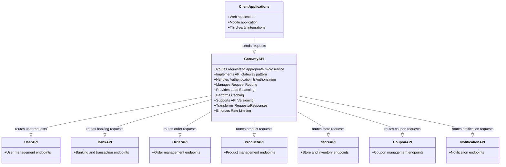
</details>

### 2. [User API](https://github.com/Fawry-Intern/user-api)  
- **Description**: Manages user operations (e.g., registration, login, profile).  

<details>
<summary>More details</summary>
UML Diagram

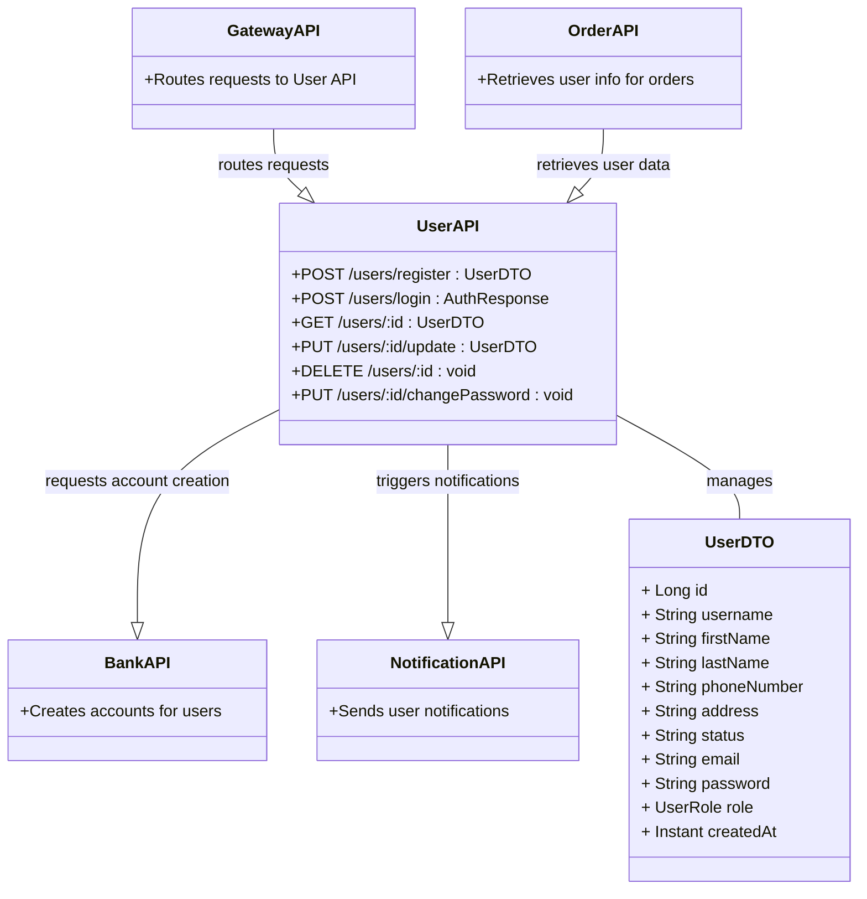

ER Diagram

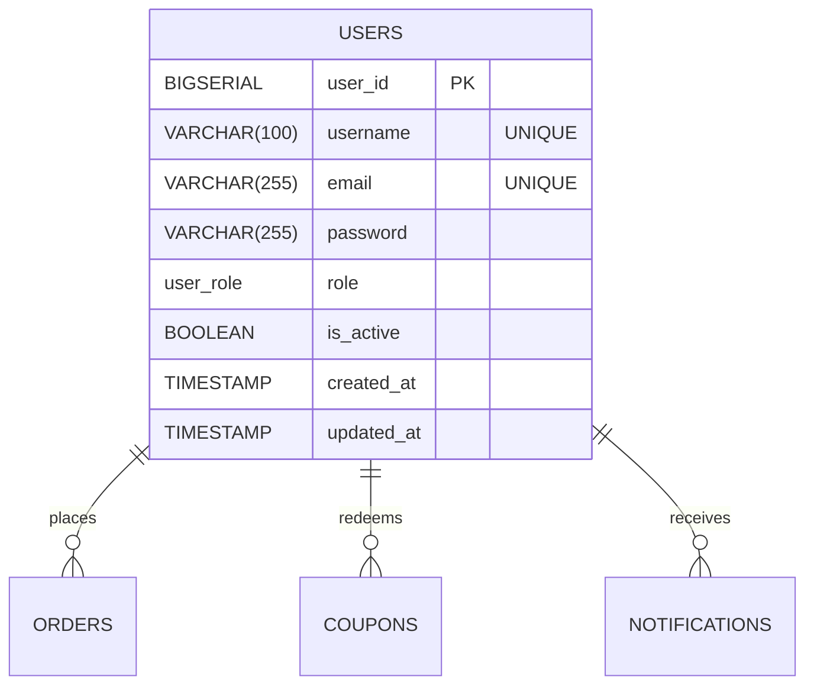

</details>

### 3. [Shipping API](https://github.com/Fawry-Intern/shipping-api)  
- **Description**: Manages shipping details, tracking, and logistics.  

<details>
<summary>More details</summary>

ER Diagram
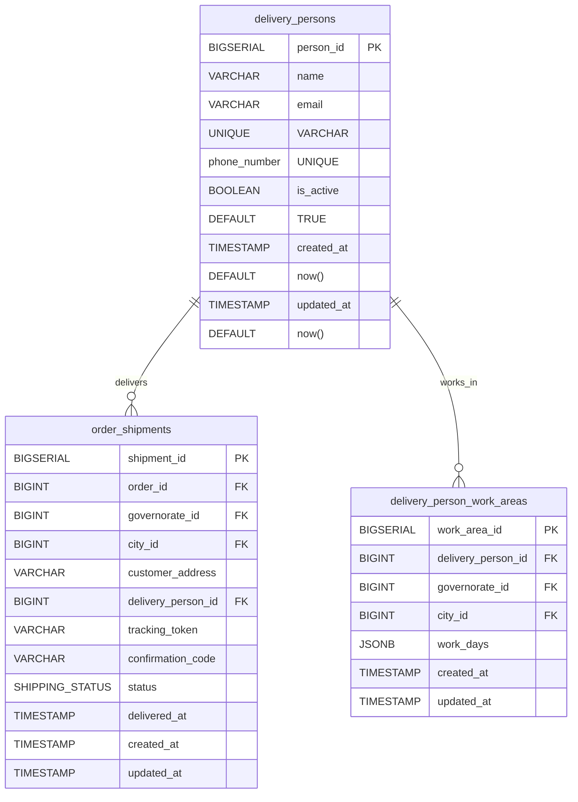

UML Diagram

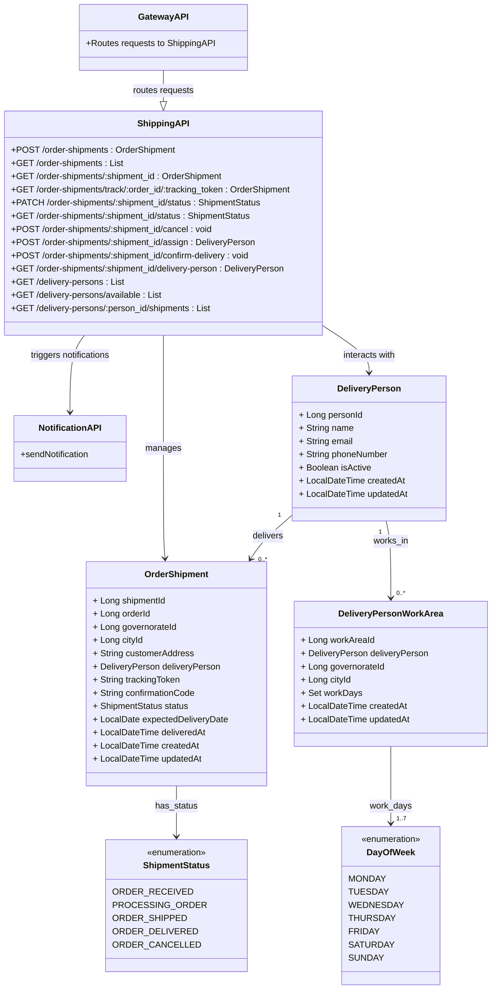

</details>

### 4. [Product API](https://github.com/Fawry-Intern/product-api)  
- **Description**: Provides CRUD operations for products and inventory.  

<details>
<summary>More details</summary>
UML Diagram

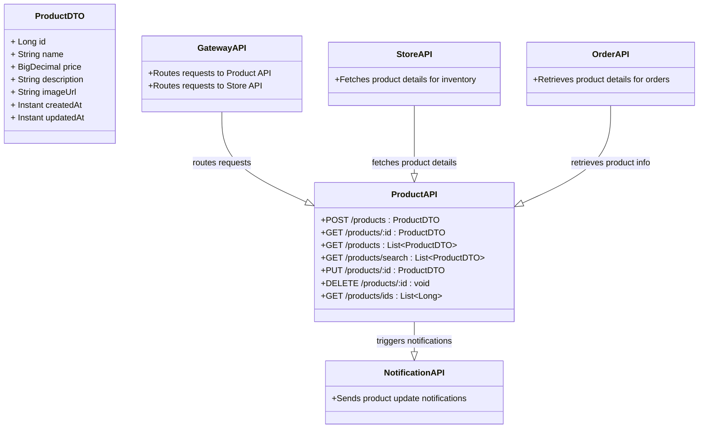

ER Diagram 

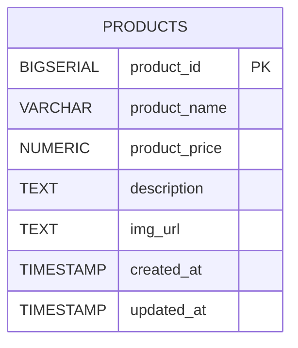
</details>


### 5. [Store API](https://github.com/Fawry-Intern/store-api)  
- **Description**: Manages store data and related operations.  

<details>
<summary>More details</summary>
UML Diagram

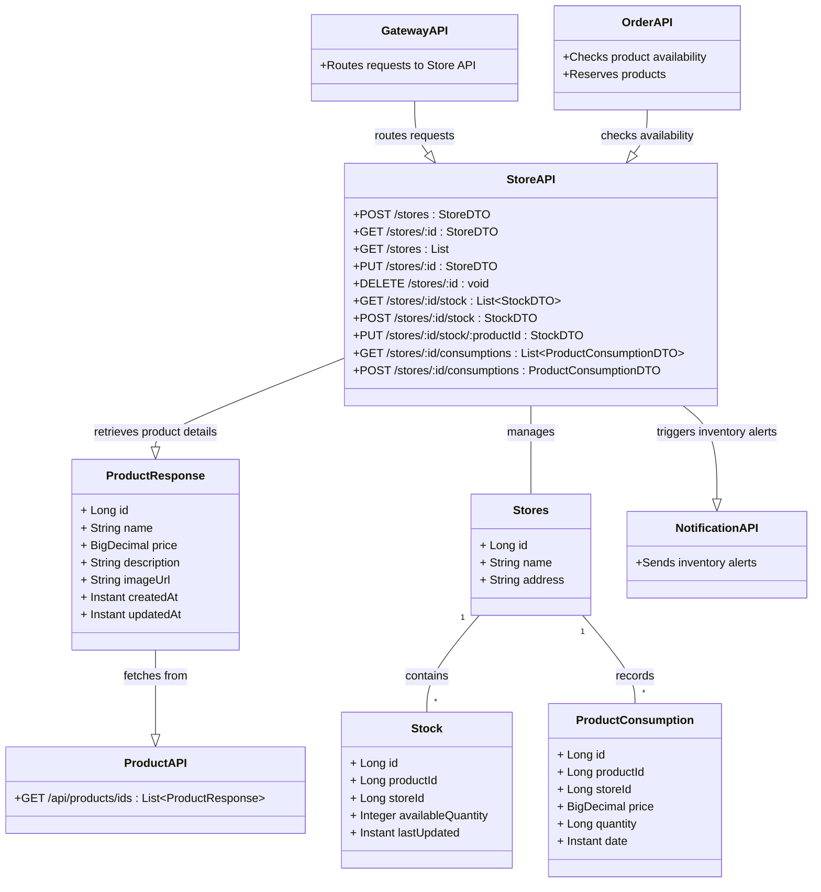

ER Diagram

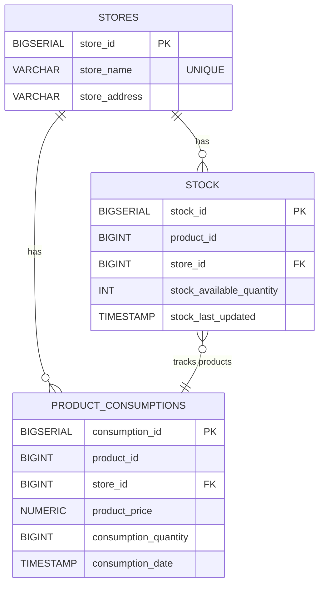

</details>


### 6. [Coupon API](https://github.com/Fawry-Intern/coupon-api)  
- **Description**: Creates and manages discount coupons.  

<details>
<summary>More details</summary>

UML Diagram

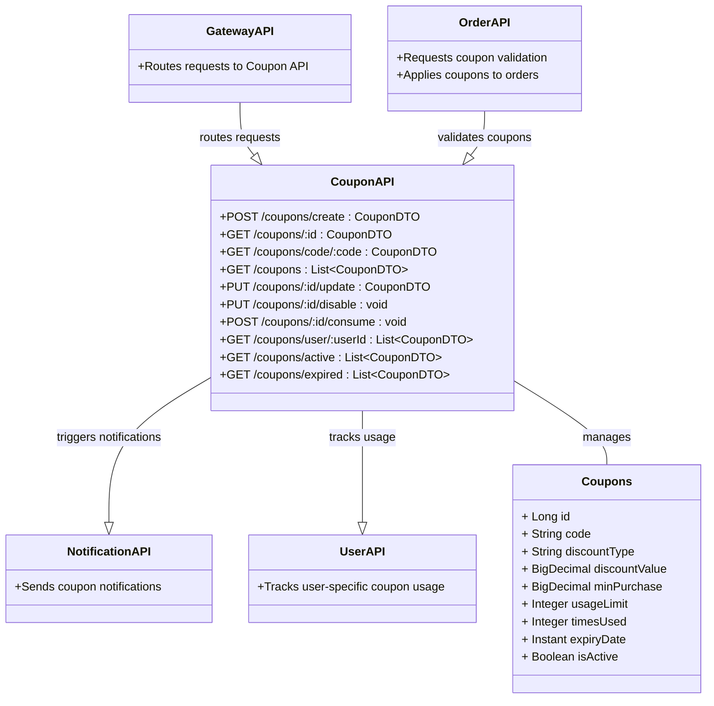


ER Diagram

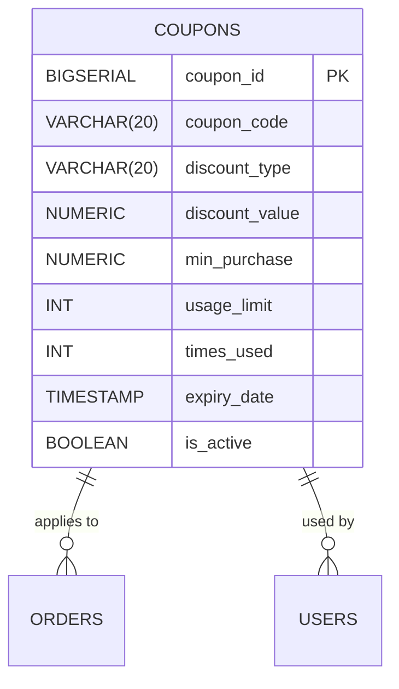

</details>


### 7. [Order API](https://github.com/Fawry-Intern/order-api)  
- Description: Handles order creation, updates, and retrieval.  

<details>
<summary>More details</summary>

Description:

- The customer initiates a checkout.
- The Order Microservice:
1. Validates the coupon with the Coupon Service.
2. Checks inventory with the Store Microservice.
3. Processes payment with the Bank Service.
4. Initiates shipping with the Shipping Microservice.
5. Sends a notification via the Notification Microservice.
- If the payment fails, the system:
  - Reverses the payment.
  - Cancels shipping.
  - Cancels the order.
  - Sends a cancellation notification.

Limitations:
- Lacked clarity on inter-service communication (e.g., REST vs. Kafka).
- Compensation steps were not detailed enough.
- No mention of database transactions or consistency mechanisms.

### Improved Design (Compensation Flow with Saga Pattern)
After researching best practices for distributed systems, I adopted the Choreographed Saga Pattern using Kafka to ensure better decoupling and consistency across services.


Description:
- Order Service: Publishes an `order_created` event to Kafka and adds the order to its local database (TX 1).
- Store Service: Consumes the event, reduces inventory, and publishes a `store_updated` event (TX 2).
- Payment Bank Service: Processes the payment and publishes a `bank_updated` event (TX 3).
- Shipping Service: Ships the order and publishes a `shipping_updated` event (TX 2).
- Compensation Flow: If any step fails (e.g., payment fails):
  - Reverse inventory (Store Service).
  - Reverse payment (Payment Bank Service).
  - Cancel shipping (Shipping Service).

Why This is Better:
- Uses Kafka for event-driven communication, reducing coupling between services.
- Ensures consistency with local transactions for each service.
- Provides a clear compensation flow for handling failures.

Order UML Class Digram


API Flow (Alternative Approach)
I also explored an API-based approach for some interactions, which is useful for synchronous calls.


Description:
- `order_products`: Fetch product details.
- `check_inventory`: Verify stock availability.
- `make_payment`: Process payment.
- `ship_order`: Initiate shipping.
- `send_notifications`: Notify customer and driver, with a reference notification.

Limitations:
- Lacks compensation details for failures.
- REST-based communication can be less reliable than Kafka for distributed transactions.

Why the Saga Pattern?
The Choreographed Saga Pattern with Kafka was chosen as the best practice because:
- It decouples services, allowing them to operate independently.
- Kafka ensures reliable event delivery and supports scalability.
- Local transactions per service maintain consistency without requiring a global transaction coordinator.

Future Improvements
- Add retry mechanisms for Kafka event publishing.
- Include the Notification Service in the compensation flow.
- Implement circuit breakers for REST-based interactions.


ER Diagram 

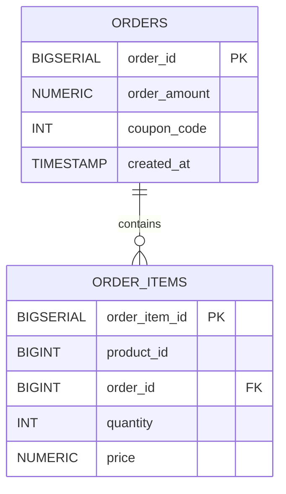
</details>


### 8. [Notification API](https://github.com/Fawry-Intern/notification-api)  
- **Description**: Sends notifications (e.g., email, SMS).  

### 9. [E-Commerce Frontend](https://github.com/Fawry-Intern/e-commerce-frontend)  
- **Description**: Web interface for interacting with the microservices.  

### 10. [Bank API](https://github.com/Fawry-Intern/bank-api)  
- **Description**: Handles payment processing, transactions, and bank-related operations.  
<details>
<summary> More details </summary>

UML Diagram

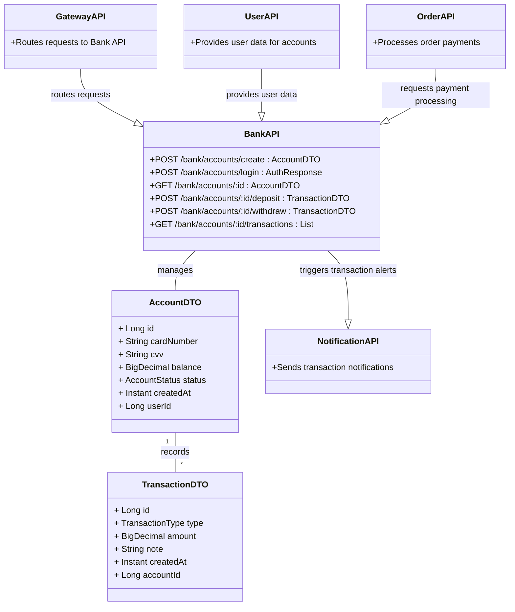

ER Diagram

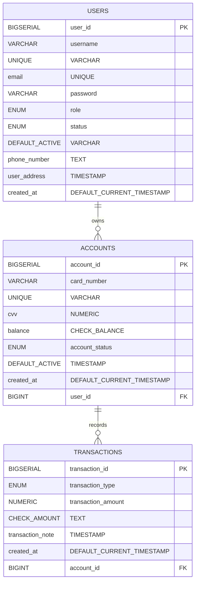

</details>

### 11. [Bank UI](https://github.com/Fawry-Intern/bank-ui)  
- **Description**: User interface for managing bank transactions and payments.  

### 12. [Eureka Server](https://github.com/Fawry-Intern/eureka-server)  
- **Description**: Service discovery for microservices, allowing dynamic registration and lookup.  

### 13. [Infrastructure](https://github.com/Fawry-Intern/infrastructure)  
- **Description**: Contains infrastructure-related configurations and deployment scripts.  
